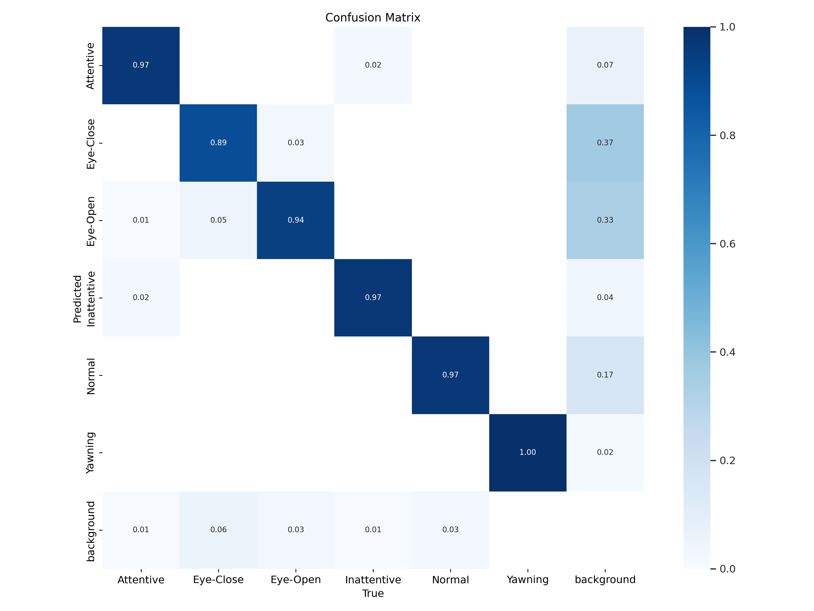
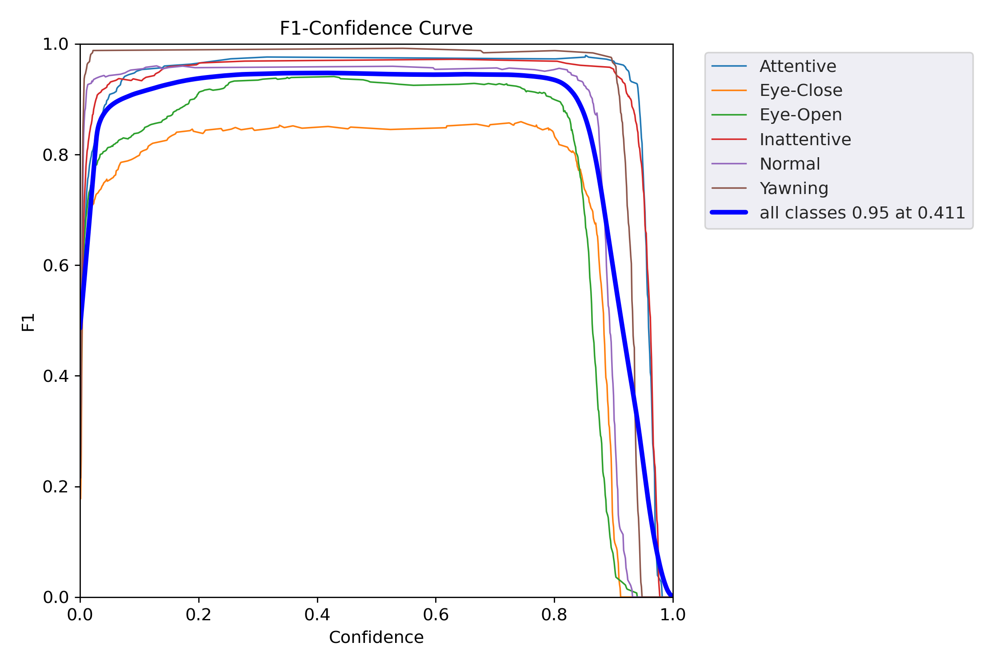
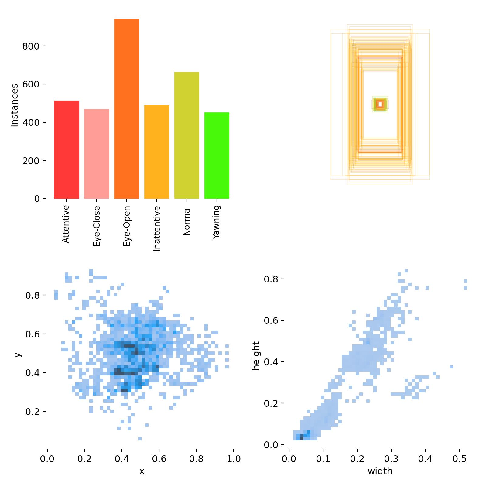
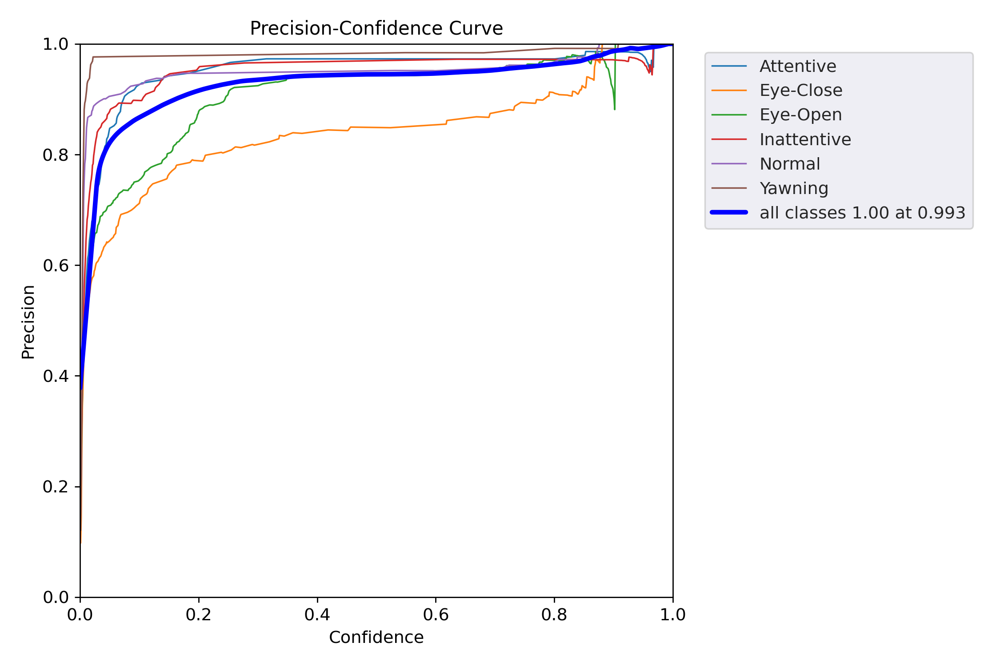
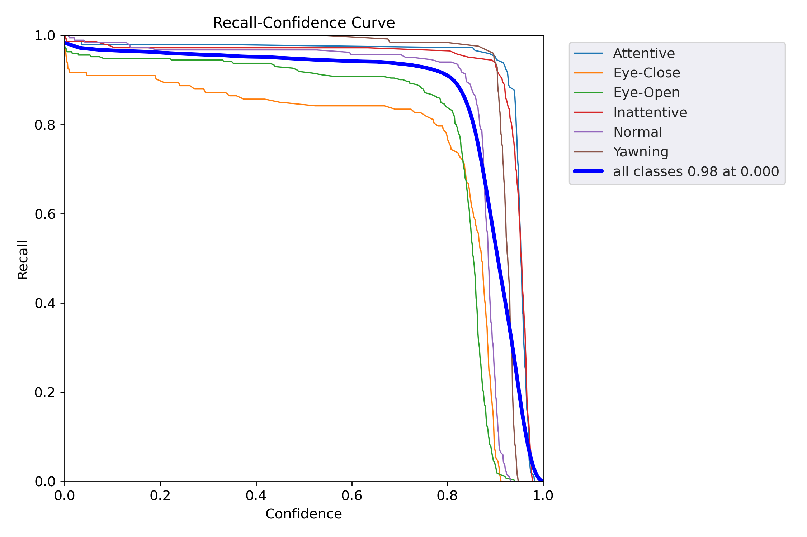
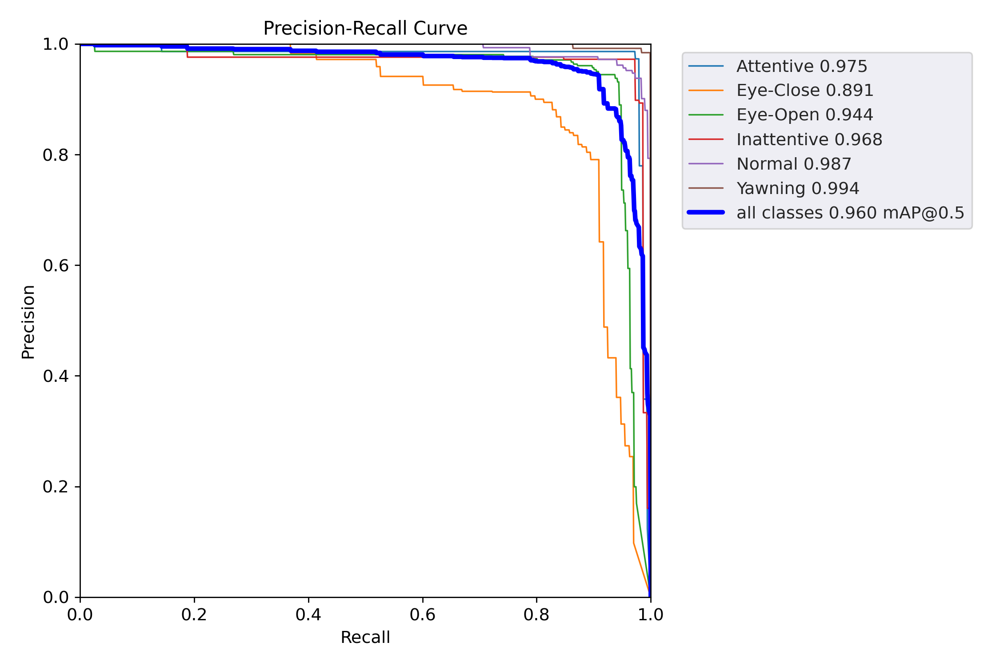
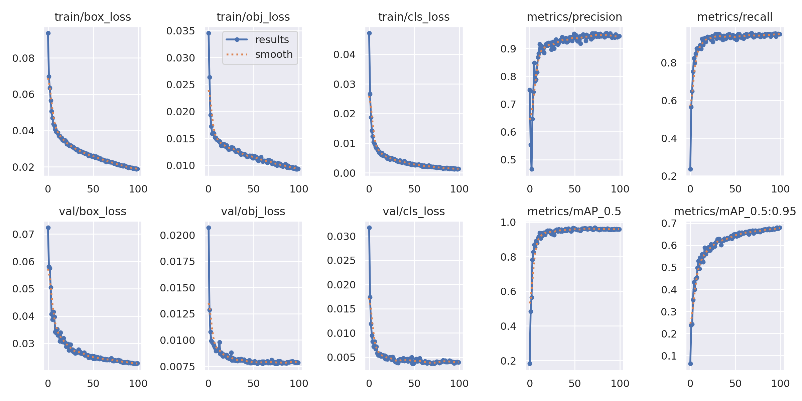

# 
 训练结果分析

### 1. confusion_matrix（混淆矩阵）

该混淆矩阵行表示预测类别，列表示真实类别，对角线元素表示正确分类，非对角线元素显示错误分类。

**准确预测率如下**：

|Attentive|Eye-Close|Eye-Open|Inattentive|Normal|Yawning|
|---|---|---|---|---|---|
|0.97|0.89|0.94|0.97|0.97|1.00|

Eye-Close被误分类为background 0.37，表明模型有时将闭眼与非物体区域混淆。
Eye-Open被误分类为background 0.33，表明睁眼有类似问题。
该矩阵表明该模型在区分Yawning方面很出色，但眼部相关类别与背景混淆可能存在问题。

### 2. F1_curve(F1曲线)

**曲线形状**：所有曲线在低置信度时接近1.0，随着置信度增加而下降。
**性能**: Yawning(棕色) 和Normal(紫色)在较高的置信度下保持高F1(>0.8)
Eye-Close(橙色)和Eye-Open(绿色)在高置信度下F1显著下降(<0.6)，表明这些类别在高置信度下的鲁棒性较差。
Attentive(青色)和Inattentive(红色)性能居中。

- 总体而言：平均F1在0.411置信度下为0.95，表明精确度和召回率平衡良好。然而，对于需要高置信度（例如>0.8）的应用，一些类别的F1下降到0.5以下，意味着模型可能需要阈值调优。
  
### 3. labels（实例分布和边界框散点图）

**复合图组成**：左上柱状图：数据集每个类别的实例数量；右上散点图：所有物体的边界框尺寸，密度以蓝色显示；底部散点图：可能按类别或额外视图的框分布，轴上有直方图。
**柱状图**：Yawning：~800个实例（最高，代表性好）；
Normal：~ 600；Inattentive：~ 500；
Eye-Open和Eye-Close：~ 400 Attentive：~ 500
**主散点图**：点密集聚在宽度0.2-0.6和高度0.2-0.6，形成一个拉长的云状。这表明大多数边界框是中等大小且有些方形（面部区域）。
**额外散点图**：按类别划分，显示的类似聚簇但密度不同。

### 4. P_curve（精确度与置信度）

**曲线形状**：精确度在低置信度下上升或保持高位，并在稳定前可能略微下降，大多从低开始上升到接近1.0
**类别性能**：所有类别和单个线在高置信度（>0.8）下达到较高的精确度；Eye-Close和Inattentive显示更多波动，在中等置信度处有下降。
**总结**：在最优阈值情况下精确度较高，模型精确但在严格阈值下可能牺牲召回率

### 5. R_curve（召回率与置信度）

**曲线形状**：低置信度下较高，随着阈值的增加而下降
**类别性能**：Yawning和Normal 保持高召回率更久
Eye-Open和Eye-Close较早下降
**总结**：低阈值下召回率较强，但高置信度下下降，与精确度权衡

### 6. PR_curve（精确度与召回率）

这条PR曲线显示每个类别的精确度 vs. 召回率，带有曲线下面积（AP）值。所有类别的mAP@0.5为0.960
**曲线形状**：高精确度/召回率平台后下降，是对好模型
**每个类别的AP**：Attentive:0.975; Eye-Close: 0.891(最低); Eye-Open:0.944; Inattentive:0.968; Normal:0.987; Yawning:0.994;
**总结**：mAP@0.5为0.960（接近1.0）较为优秀

### 7.result.png（训练指标图）

**损失图（左侧）**：

- train/box_loss、train/obj_loss、train/cls_loss：早期急剧下降（例如box_loss从0.09到0.02），然后趋于平稳，表明收敛。
- val/box_loss、val/obj_loss、val/cls_loss：类似趋势，验证损失略高但稳定，无过拟合迹象（差距小）。

**指标图（右侧）**：

- metrics/precision：从~ 0.75上升到~ 0.95
- metrics/recall：从~ 0.24到~ 0.95
- metrics/mAP_0.5：从~ 0.18到~ 0.96
- metrics/mAP_0.5:0.95：从~ 0.06到~ 0.68

**总结**：曲线平滑无振荡，表明训练稳定，指标持续改善，达到高峰

### 8. result.csv

CSV跟踪了100个轮次的指标
**指标改善**：精确度：从0.75072到~0.945；召回率：从0.23549到~0.952；mAP_0.5：从0.18225到0.95959（很高）；mAP_0.5:0.95：从0.063538到0.67995（较好）
**学习率（lr0、lr1、lr2）**：按调度器预期下降；
**损失**：训练和验证损失从高初始值下降，在轮次50-60左右稳定，显示有效优化。

### 总结

整体性能较好，对于Yawning和Normal判断良好，但与背景混淆和较低的AP，需要增强鲁棒性。
