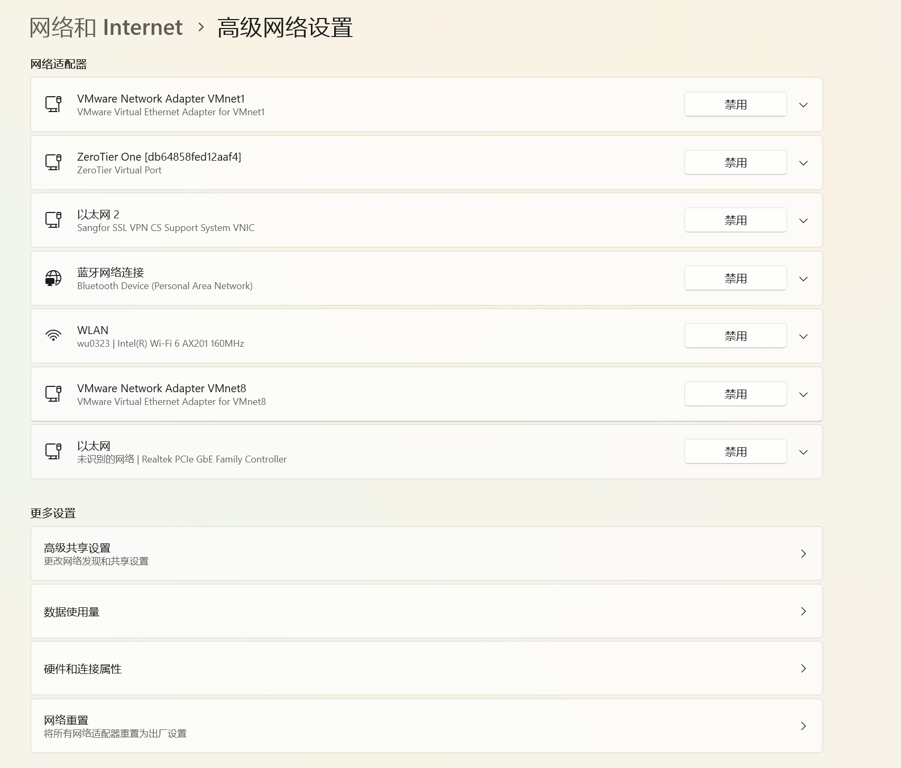
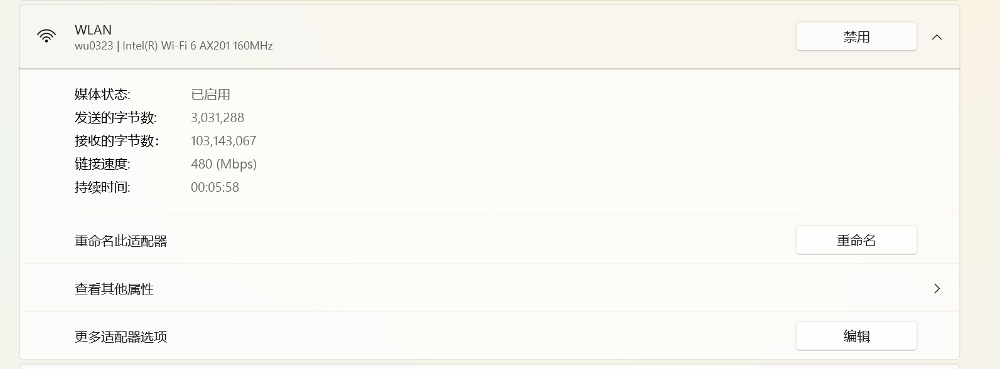
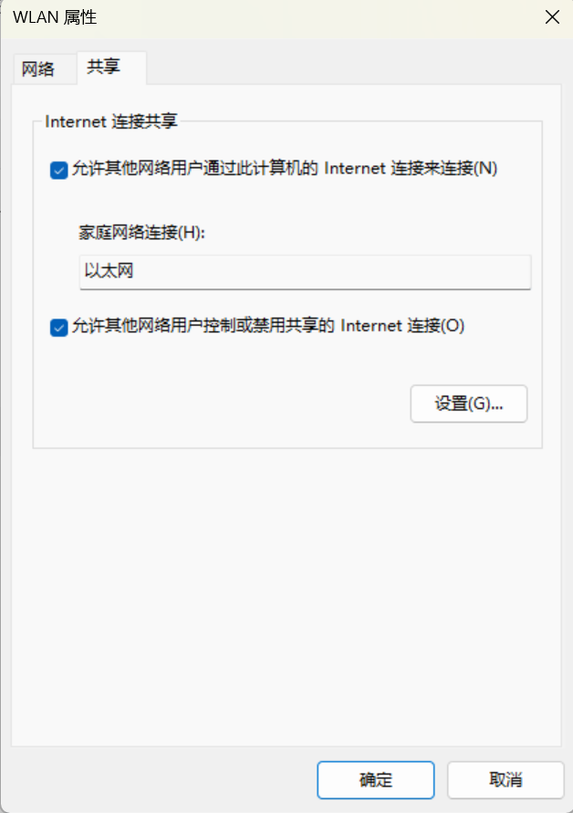
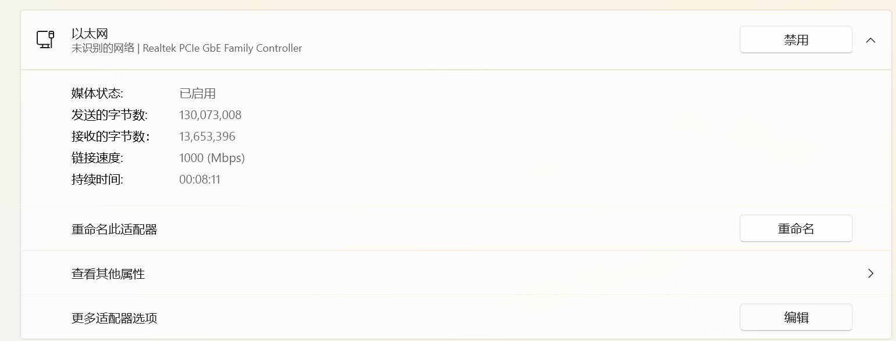
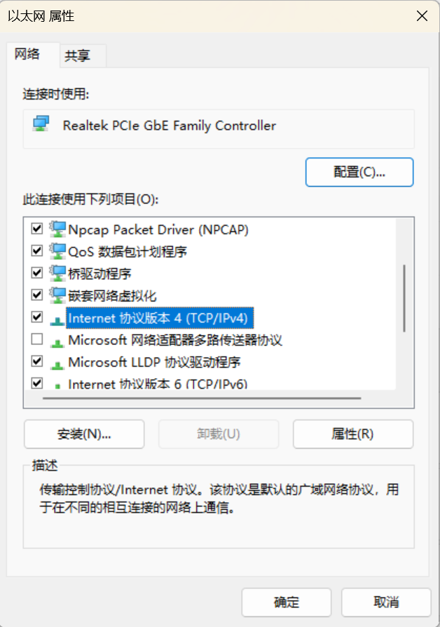
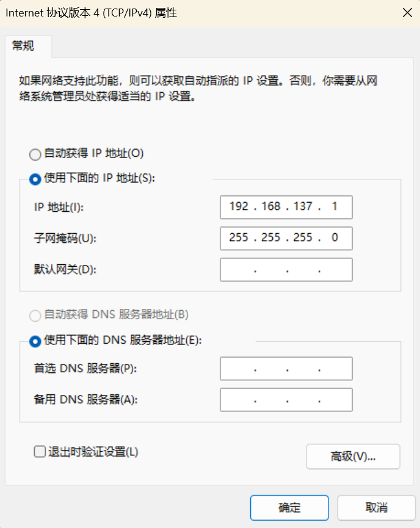
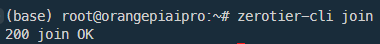
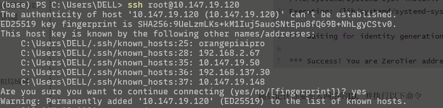

# 昇腾算力香橙派 OrangePi AIPro（8T）YOLOv10推理任务迁移手册

## 一、基本准备工作

### 1. 烧录系统

详情参见官方教程。可以使用昇腾官方的制卡工具`Ascend devkit imager`，也可以使用传统的`balenaEtcher`。此处不再赘述。

### 2. 设置SSH连接和静态IP

#### 2.1 PC端设置（`Windows`为例）

通过网线连接后，一般来说对应的网络适配器是`以太网0`。我们需要修改网络适配器的属性，从而实现静态IP。

1. 在任务栏的搜索框中输入“管理网络适配器设置”，并进入设置页面。

   

   > 或者打开“设置”——“网络和Internet”——“高级网络设置”

2. 找到当前的WLAN，编辑网络适配器属性，打开共享功能，并设置共享连接的网络适配器为“以太网”：

   

   

3. 找到最下面的“以太网”，编辑网络适配器属性（下图中，找到“更多适配器选项”，点击“编辑”）：

   

   找到下图所示的IPv4功能，双击打开：

   

   

   设置成上图这样，点“确定”保存。

   > 实际上，应该只需要把Windows端的IP设置成同一网段的IP就可以？

   > 实际上先设置好WLAN的共享，打开后好像是会自动变成上图这样？如果已经变成这样，不要动，直接退出；如果仍然显示自动获得，可以直接尝试`ssh`连接试一下，如果不好使再调整。

这下个人电脑这边就好了，剩下需要调整开发板。

#### 2.2 开发板设置

> 已经提前设置好，这一部分无需远程用户操作。项目中运维负责人需要注意。

##### 2.2.1 静态IP设置

实际上，就是通过以下两条命令来设置网关地址和静态IP地址，并把它加入到开机自动执行的命令里（`/etc/profile`）：

```bash
ifconfig eth0 192.168.137.30 up # IPv4 addr of ethernet0
route add default gw 192.168.137.1 # gw: gateway
```

> 实际使用时会遇到权限问题，这时候可以通过设置`setuid`权限位来解决特定命令的权限问题。具体来说，执行以下命令：
>
> ```bash
> sudo chmod u+s /usr/sbin/ifconfig
> sudo chmod u+s /usr/sbin/route
> ```
>
> 或者也可以通过修改`sudoers`文件来实现，但是在这个板子上似乎并不好使，暂不清楚缘由。

所以，现在这个板子在通过网线和电脑直连时，以太网的IPv4地址是`192.168.137.30`，默认网关是`192.168.137.1`。

##### 2.2.2 解决`nmcli`自动管理与以上设置冲突的问题

实际连接中会发现，按照以上方法设置开发板虽然在每次开机时可以顺利进入，但是过了一小会就会自动断开连接，并且按照原IP输入重新尝试连接时不成功。经过检查后，发现是因为`Network Manager`默认会自动配置以太网的IP，所以就会出现当它重新配置IP后导致SSH连接失效的问题。以下给出解决方案。

```bash
(base) root@orangepiaipro:~# nmcli
eth0: connected to Wired connection 1 # 记住此处的以太网名
        "eth0"
        ethernet (hns3-platform), C0:74:2B:FD:DA:7C, hw, mtu 1500
        ip4 default
        inet4 192.168.137.118/24
        route4 192.168.137.0/24 metric 100
        route4 default via 192.168.137.1 metric 100
        inet6 fe80::5ee1:4c5d:b5b:38fa/64
        route6 fe80::/64 metric 1024

ztksezojiz: connected (externally) to ztksezojiz
        "ztksezojiz"
        tun, F6:73:45:D2:49:36, sw, mtu 2800
        inet4 10.147.19.148/24
        route4 10.147.19.0/24 metric 0
        inet6 fe80::f473:45ff:fed2:4936/64
        route6 fe80::/64 metric 256

wlan0: connected to HUAZHU-Hanting
        "Realtek Wi-Fi"
        wifi (rtl8821cu), 28:F5:2B:A7:BA:FC, hw, mtu 1500
        inet4 192.168.51.66/20
        route4 192.168.48.0/20 metric 600
        route4 default via 192.168.50.254 metric 600
        inet6 fe80::9fa0:1515:8e49:293a/64
        route6 fe80::/64 metric 1024

docker0: connected (externally) to docker0
        "docker0"
        bridge, 4E:DF:DB:0D:51:05, sw, mtu 1500
        inet4 172.17.0.1/16
        route4 172.17.0.0/16 metric 0

p2p-dev-wlan0: disconnected
        "p2p-dev-wlan0"
        wifi-p2p, hw

bond0: unmanaged
        "bond0"
        bond, 7A:9D:C3:16:FE:49, sw, mtu 1500

lo: unmanaged
        "lo"
        loopback (unknown), 00:00:00:00:00:00, sw, mtu 65536

DNS configuration:
        servers: 192.168.137.1
        domains: mshome.net
        interface: eth0

        servers: 210.22.70.3 210.22.84.3

(base) root@orangepiaipro:~# nmcli con show "Wired connection 1" # 网络名超过一个单词需要用引号套住
connection.id:                          Wired connection 1
connection.uuid:                        da58fe05-e694-3bc2-a263-10aa9038fa98
connection.stable-id:                   --
connection.type:                        802-3-ethernet
connection.interface-name:              eth0
connection.autoconnect:                 yes
connection.autoconnect-priority:        -999
connection.autoconnect-retries:         -1 (default)
connection.multi-connect:               0 (default)
connection.auth-retries:                -1
connection.timestamp:                   1754714736
connection.read-only:                   no
connection.permissions:                 --
connection.zone:                        --
connection.master:                      --
connection.slave-type:                  --
connection.autoconnect-slaves:          -1 (default)
connection.secondaries:                 --
connection.gateway-ping-timeout:        0
connection.metered:                     unknown
connection.lldp:                        default
connection.mdns:                        -1 (default)
connection.llmnr:                       -1 (default)
connection.dns-over-tls:                -1 (default)
connection.wait-device-timeout:         -1
802-3-ethernet.port:                    --
802-3-ethernet.speed:                   0
802-3-ethernet.duplex:                  --
802-3-ethernet.auto-negotiate:          no
802-3-ethernet.mac-address:             --
802-3-ethernet.cloned-mac-address:      --
802-3-ethernet.generate-mac-address-mask:--
802-3-ethernet.mac-address-blacklist:   --
802-3-ethernet.mtu:                     auto
802-3-ethernet.s390-subchannels:        --
802-3-ethernet.s390-nettype:            --
802-3-ethernet.s390-options:            --
802-3-ethernet.wake-on-lan:             default
802-3-ethernet.wake-on-lan-password:    --
802-3-ethernet.accept-all-mac-addresses:-1 (default)
ipv4.method:                            auto  # 看到关键在这里，IPv4的设置是auto模式，且未设置默认的DNS，所以才会出现问题。
ipv4.dns:                               --
ipv4.dns-search:                        --
ipv4.dns-options:                       --
ipv4.dns-priority:                      0
ipv4.addresses:                         --
ipv4.gateway:                           --
ipv4.routes:                            --
ipv4.route-metric:                      -1
ipv4.route-table:                       0 (unspec)
ipv4.routing-rules:                     --
(base) root@orangepiaipro:~# nmcli con mod "Wired connection 1" ipv4.method manual ipv4.addresses 192.168.137.30/24 ipv4.gateway 192.168.137.1 #设置IPv4手动管理，地址为192.168.137.30，网关为192.168.137.1
(base) root@orangepiaipro:~# nmcli con mod "Wired connection 1" ipv4.dns "114.114.114.114 8.8.8.8" # 设置DNS
(base) root@orangepiaipro:~# nmcli con down "Wired connection 1" && nmcli con up "Wired connection 1" # 重启网络
Connection 'Wired connection 1' successfully deactivated (D-Bus active path: /org/freedesktop/NetworkManager/ActiveConnection/154)
Connection successfully activated (D-Bus active path: /org/freedesktop/NetworkManager/ActiveConnection/155)
```

按照以上步骤配置，就能重新使用SSH连接了。

### 3. DNS设置

如果使用以太网口共享主机的Internet连接，就会出现一个问题，即在开发板想要使用外部的网络连接时，DNS会失效，于是开发板无法通过外部网络联网。这是因为`systemd-resolved`服务在自动管理你的DNS，它会将`/etc/resolv.conf`设置成本机回送地址，也就是一个**桩解析器（Stub Resolver）**，将域名解析请求回送给本机的DNS。一个典型的由以上服务生成的文件如上：

```bash
(base) root@orangepiaipro:~# cat /etc/resolv.conf
# This is /run/systemd/resolve/stub-resolv.conf managed by man:systemd-resolved(8).
# Do not edit.
#
# This file might be symlinked as /etc/resolv.conf. If you're looking at
# /etc/resolv.conf and seeing this text, you have followed the symlink.
#
# This is a dynamic resolv.conf file for connecting local clients to the
# internal DNS stub resolver of systemd-resolved. This file lists all
# configured search domains.
#
# Run "resolvectl status" to see details about the uplink DNS servers
# currently in use.
#
# Third party programs should typically not access this file directly, but only
# through the symlink at /etc/resolv.conf. To manage man:resolv.conf(5) in a
# different way, replace this symlink by a static file or a different symlink.
#
# See man:systemd-resolved.service(8) for details about the supported modes of
# operation for /etc/resolv.conf.

nameserver 127.0.0.53
options edns0 trust-ad
search lan
```

另外，`NetworkManager`也可能管理你的DNS，从而改变你手动编辑的内容。为了开发板能够顺利切换网络，我们要设置固定的DNS配置。

#### 解决方法

1. 关闭`systemd-resolved`

   ```bash
   sudo systemctl disable systemd-resolved --now
   ```

> 在这之前可以先执行`sudo systemctl status systemd-resolved`命令检查这一服务是否在运行中。

2. 修改`NetworkManager`设置

   ```bash
   sudo nano /etc/NetworkManager/NetworkManager.conf
   ```

   然后加上：

   ```bash
   [main]
   dns=none
   ```

   随后执行：

   ```bash
   sudo systemctl restart NetworkManager
   ```

   之后请手动编辑你的`/etc/resolv.conf`文件，应该就可以在各种网络环境下根据你设置的DNS解析域名。以我的设置为例：

   ```shell
   nameserver 223.5.5.5
   nameserver 8.8.8.8 # Google
   nameserver 114.114.114.114 
   ```

### 4. 风扇转速设置

默认的风扇转速并不足以让板子降温，在跑代码的时候散热效果更是让人不能满意。所以需要通过`npu-smi`设置风扇转速。

```bash
sudo npu-smi set -t pwm-mode -d 0 # 0: manual 1: auto
sudo npu-smi set -t pwm-duty-ratio -d 100 # 0: 不动 100: 速度最大
sudo npu-smi info -t pwm-duty-ratio # 查看当前风扇转速
```

还可以根据以上命令写一些自动化的调整脚本。

### 5. 配置代理

我使用的是这个仓库中的脚本：https://github.com/nelvko/clash-for-linux-install.git，开发者也可根据喜好自行选择代理软件。

如果初次拉取因没有代理而出现问题，可以使用加速前缀https://gh-proxy.com/，也可以在本机下载压缩包解压后通过SSH传入开发板。随后请参考本仓库的`README.md`。

#### 5.1 配置Git代理

在以上这个脚本运行后，Git的代理并没有随之设置好，我们还需要手动配置以下Git的全局代理，从而能够顺利地从Github上拉取代码。

执行以下两行代码，配置HTTP代理：

```bash
git config --global http.proxy http://127.0.0.1:7890 # http代理（Clash的默认端口7890）
git config --global https.proxy https://127.0.0.1:7890 # https代理
```

随后可以使用这两行命令分别取消代理：

```bash
git config --global --unset http.proxy
git config --global --unset https.proxy
```

还可以使用以下命令检查代理：

```bash
git config --global --get http.proxy
git config --global --get https.proxy\
```

关于SSH连接的配置方法暂略，开发者可以自行在网上搜索教程。

### 6. 配置`Zerotier`虚拟局域网（可选）

在团队合作的时候需要保证每一个成员都能顺利连接到开发板，传统的方法是配置内网穿透。这里我们使用了一种更加便捷的方法——配置Zerotier的VLAN，从而使得大家都能通过私有IP登录到同一开发板。

关于其原理和用户端的配置方法，已经在另一篇文章讲得比较清楚了，这里给出主机端（开发板）配置的命令。

#### 6.1 开发板部署

```bash
curl -s https://install.zerotier.com | sudo bash
# or
curl -s 'https://raw.githubusercontent.com/zerotier/ZeroTierOne/main/doc/contact%40zerotier.com.gpg' | gpg --import &amp;&amp; \
if z=$(curl -s 'https://install.zerotier.com/' | gpg); then echo "$z" | sudo bash; fi
```

执行完以上任意一条指令后，会出现：

```bash
*** Enabling and starting ZeroTier service...
Synchronizing state of zerotier-one.service with SysV service script with /lib/systemd/systemd-sysv-install.
Executing: /lib/systemd/systemd-sysv-install enable zerotier-one

*** Waiting for identity generation...

*** Success! You are ZeroTier address [ b4dc320f09 ].
```

随后记住你要加入网络的ID，并执行以下命令

```bash
sudo zerotier-cli join xxxxxxxx # Network ID
```

就可以实现不在同一局域网内的远程连接了。如下图，出现这样的标识证明已经成功加入。



此后如果仍然发现无法连接，需要重启以下`zerotier-one`的服务。

```bash
sudo systemctl restart zerotier-one
```

然后基本上就可以连接了，初次连接/重新配zerotier的时候一般会出现类似这样的提示：



之后就可以正常连接。

### 7. 设置算力超频（可选）

Orange AIPro默认`1GHz`的情况下可提供提供的算力为 `8 TOPS`，可以每秒钟执行 8 万亿次浮点运算。后续可通过官方提供的firmware补丁包超频CPU到`1.6GHz`，同时可超频AI算力到`12TOPS`。

打开香橙派官网，找到对应型号的资料页面，点击“官方工具——下载”，在百度网盘中找到对应的超频固件包下载到开发板里。这里给出官网链接：

http://www.orangepi.cn/html/hardWare/computerAndMicrocontrollers/service-and-support/Orange-Pi-AIpro.html

下载好固件包后，依次执行以下几行命令：

```bash
chmod +x Ascend310B-firmware-7.3.t10.0.b528-rc-signed-opiaipro-12t-1.6ghz-20240605.run 
./Ascend310B-firmware-7.3.t10.0.b528-rc-signed-opiaipro-12t-1.6ghz-20240605.run --full
```

提示更新完成后，断电重启系统。重启后使用以下命令切换算力挡位：

```bash
(base) root@orangepiaipro:~# npu-smi set -t nve-level -i 0 -c 0 -d 1
        Status                         : OK
        Message                        : The nve-level of the chip is set successfully.
```

随后再次重启，执行以下命令，如果“aicore freq”像下面一样变成了“750”，那么就代表升级成功。

```bash
(base) root@orangepiaipro:~# grep "aicore freq" /var/log/npu/slog/device-0/device-0*
[INFO] LPM(-1,null):1970-01-01-00:00:15.964000 [avs] [AvsProfileLimitUpdate 55] profile[1] aicore freq[750] cpu freq[1600] config done
```

### 8. 升级昇腾CANN工具包和内核

在[此网页](https://www.hiascend.com/developer/download/community/result?module=cann&cann=8.2.RC1)中下载资源，因为无法直接用`wget`或`curl`获取，所以建议连接外部显示屏使用桌面环境下载。（这类情况下软件包默认被下载到`/home/HwHiAiUser/Downloads`目录中）

下载好后依次执行以下命令（示例）：

```bash
cd /home/HwHiAiUser/Downloads
chmod +x Ascend-cann-toolkit_8.2.RC1_linux-aarch64.run
chmod +x Ascend-cann-kernels-310b_8.2.RC1_linux.run
./Ascend-cann-toolkit_8.0.RC2_linux-aarch64.run --install --install-for-all --quiet
./Ascend-cann-kernels-310b_8.0.RC2_linux.run --install --install-for-all --quiet
```

安装完成后，检查用户`.bashrc`里是否存在以下这一行命令：
```bash
source /usr/local/Ascend/ascend-toolkit/set_env.sh
```

如果没有，请执行以下命令添加环境变量：

```bash
echo 'source /usr/local/Ascend/ascend-toolkit/set_env.sh' >> ~/.bashrc
source ~/.bashrc
```

### 9. 设置Control CPU工作数量（可选）

开发板使用的昇腾 SOC 总共有 4 个 CPU，这 4 个 CPU 既可以设置为control CPU，也可以设置为 AI CPU。默认情况下，control CPU 和AI CPU 的分配数量为3:1。使用 npu-smi info 命令可以查看下 control CPU 和 AI CPU 的分配数量。

```bash
(base) HwHiAiUser@orangepiaipro:~# npu-smi info -t cpu-num-cfg -i 0 -c 0
Current AI CPU number : 1
Current control CPU number : 3
Current data CPU number : 0
(base) HwHiAiUser@orangepiaipro:~#
```

在模型转换等过程中，我们暂时不需要设置AI CPU，所以可以把所有CPU都设置成control CPU，等到需要AI CPU的时候再切换回来。执行以下命令：
```bash
npu-smi set -t cpu-num-cfg -i 0 -c 0 -v 0:4:0
```

随后执行`reboot`重启，完成变更。

### 10. 设置交换内存（可选）

1. 创建swap文件

   ```bash
   fallocate -l 32G /swapfile
   ```

2. 修改文件权限

   ```bash
   chmod 600 /swapfile
   ```

3. 设置成swap空间

   ```bash
   mkswap /swapfile
   ```

4. 启用swap

   ```bash
   swapon /swapfile
   ```

5. 如果需要开机自启，请执行以下命令：

   ```bash
   echo '/swapfile none swap sw 0 0' | tee -a /etc/fstab
   ```

6. 查看swap状态

   ```bash
   free -h
   ```

## 二、模型工作

### 1. 准备onnx模型

有两种方式获得示例模型。一是克隆YOLOv10的[Github仓库](https://github.com/THU-MIG/yolov10.git)，并使用`ultralytics`的转换工具将`.pt`格式的模型转换成`onnx`格式（此处具体细节可以参考仓库的`README.md`文件），二是可以直接从[官方的`release`界面下载](https://github.com/THU-MIG/yolov10/releases)它提供的`onnx`格式的模型文件。具体步骤略。

### 2. 转换成`om`格式模型

使用昇腾自带的`atc`工具。执行命令：
```bash
atc --model=yolov10m.onnx --framework=5 --output=yolov10m_310B4 --input_shape="images:1,3,640,640"  --soc_version=Ascend310B4
```

可能会碰见如下的提示，但是不代表转化失败，无需担心：

```bash
(base) HwHiAiUser@orangepiaipro:~/Codes/yolov10-om/models$ atc --model=yolov10m.onnx --framework=5 --output=yolov10m_310B4 --input_shape="images:1,3,640,640" --soc_version=Ascend310B4 
ATC start working now, please wait for a moment.
.........Warning: tiling offset out of range, index: 32 ............... ATC run success, welcome to the next use.
W11001: [PID: 23383] 2025-08-27-20:57:16.972.690 Op [/model.23/Mod] does not hit the high-priority operator information library, which might result in compromised performance. W11001: [PID: 23383] 2025-08-27-20:57:16.980.726 Op [/model.23/Div] does not hit the high-priority operator information library, which might result in compromised performance.
```

### 3. 安装`ACLLite-python`库

可以参考[仓库链接](https://gitee.com/ascend/ACLLite/tree/master/python)中的官方教程。

> 实际安装过程中不能原封不动按照教程来，几处需要注意的操作总结如下：
>
> 1. 
>
> 2. 先在`~/`下克隆下来这个仓库，再执行教程中的操作
>
> 3. 执行这一步时：
>
> ```bash
> # 安装ffmpeg
>  sudo apt-get install -y libavformat-dev libavcodec-dev libavdevice-dev libavutil-dev libswscale-dev libavresample-dev
> ```
>
> ​	需要把最后一个库改成`libswresample-dev`。
>
> 4. 执行这一步时：
>
> ```bash
> python3 -m pip install av==6.2.0
> ```
>
> ​	会出现版本不兼容的问题。因此命令需要去掉版本号，直接	让`pip`选择合适版本安装即可。

### 4. 使用`ACLLite-python`进行推理

#### 4.1 构建项目目录

迁移过来的项目的结构可以自行决定，我们使用的主框架代码来自于<u>昇腾社区用户“蹦蹦炸弹max”</u>的[仓库](https://gitee.com/aspartamej/yolov10_om_infer/blob/main/python/yolov10_acllite.py)。

基于此代码，我们的项目目录结构应为以下所示：

```bash
(base) root@orangepiaipro:~/Codes# cd yolov10-om/
(base) root@orangepiaipro:~/Codes/yolov10-om# tree -A
.
├── __pycache__
│   ├── classes.cpython-39.pyc
│   └── utils.cpython-39.pyc
├── classes.py
├── data
│   ├── video0.mp4
│   ├── video1.mp4
│   └── video2.mp4
├── models
│   ├── yolov10m.onnx
│   └── yolov10m_310B4.om
├── outputs
│   ├── output-20250827221149.mp4
│   ├── output-20250827222931.mp4
│   └── output-20250827223426.mp4
├── utils.py
└── yolov10_acllite.py

4 directories, 13 files

```

- `data/`：待推理数据，可以是图片/视频；
- `outputs/`：输出结果；
- `classes.py`：类别标签文件；
- `utils.py`：保存了图像预处理和结果可视化的代码；

#### 4.2 尝试推理

首先确保已经将`ACLLite`库复制到应有的位置。重新执行一遍以下命令：

```bash
cp -r ${HOME}/ACLLite/python ${THIRDPART_PATH}
```

然后，打开你的`yolov10_acllite.py`所在的目录，在确保`yolov10_acllite.py`中**已经设置好了对应的输入样本（图片/视频），且`data/`下有对应的数据文件后**，执行`python yolov10_acllite.py`这一命令。得到以下提示：

```bash
(base) root@orangepiaipro:~/Codes/yolov10-om# python3 yolov10_acllite.py
[INFO]  init resource stage:
[INFO]  Init resource success
[INFO]  Init model resource start...
[INFO]  AclLiteModel create model output dataset:
[INFO]  malloc output 0, size 7200
[INFO]  Create model output dataset success
[INFO]  Init model resource success
Processing frames: 100%|██████████████████████████| 649/649 [01:31<00:00,  7.12frame/s]
[INFO]  preprocess time: 3394.7649999999994 ms
[INFO]  infer time: 39564.448999999986 ms
[INFO]  postprocess time: 1214.6170000000016 ms
[INFO]  acl resource release all resource
[INFO]  dvpp resource release success
[INFO]  AclLiteModel release source success
[INFO]  acl resource release stream
[INFO]  acl resource release context
[INFO]  Reset acl device 0
[INFO]  Release acl resource success
```

就说明成功了！可以在`outputs/`中查看输出结果。

## 三、参考内容

[1] [基于香橙派AI Pro的yolov10模型推理迁移](https://www.hiascend.com/forum/thread-02101160479708305054-1-1.html)；

[2] [昇腾ACLLite库gitee主页](https://gitee.com/ascend/ACLLite/).
